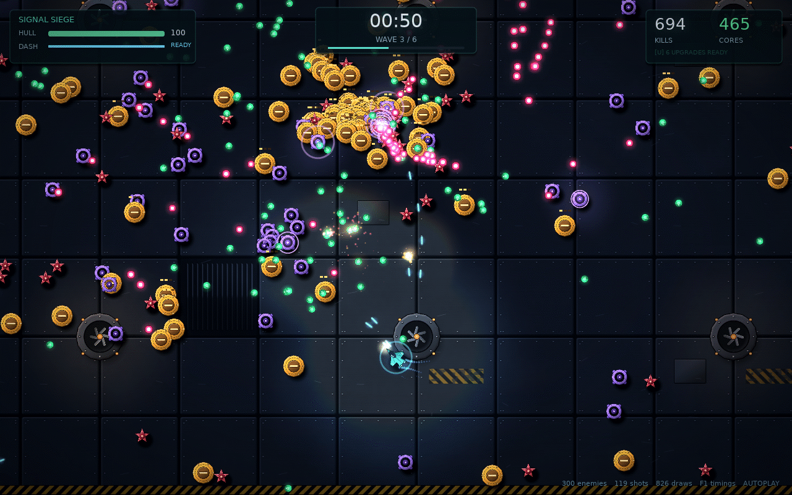
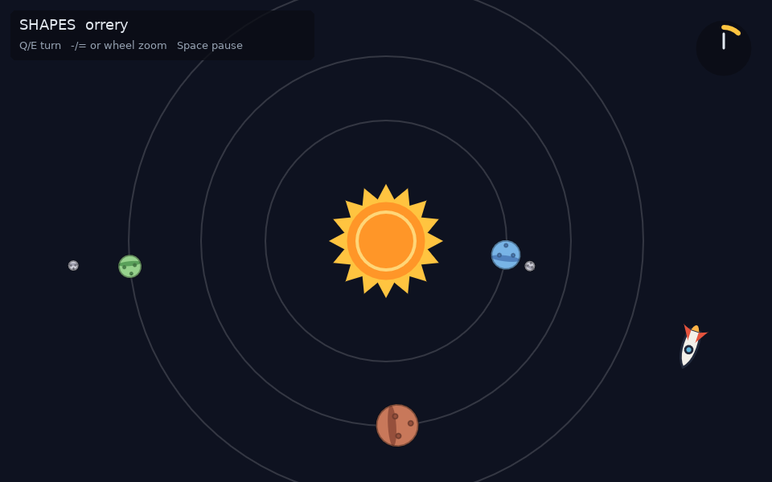
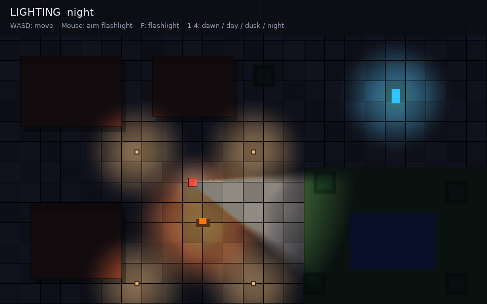
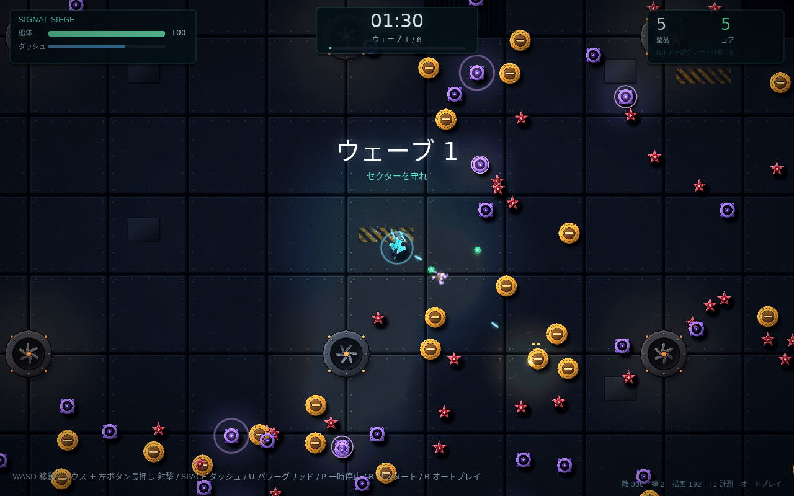
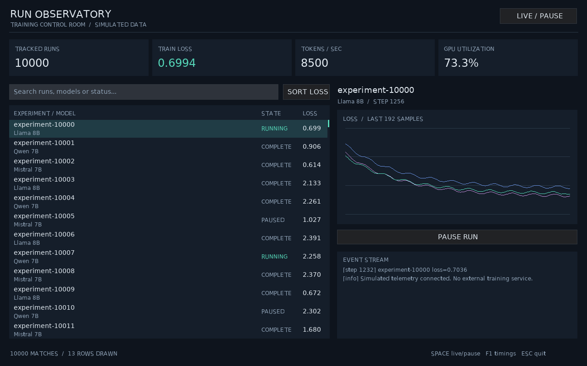

# Kin

[](https://github.com/AmedeoBiolatti/kin/actions/workflows/ci.yml)
[](LICENSE)

Kin is a C++23 game engine for humans and AI agents alike. It targets small,
incremental **2D** games — turn-based strategy, card, and puzzle games — and is
built to be driven from code, the command line, and automated agents. It starts
small, stays honest about its scope, and grows alongside the games built with it.
[The manifest](docs/manifest.md) explains the design philosophy.

> **Status — v0.2.5.** The engine, its test suite, demos (`games/`) and two
> performance examples (`examples/`). 0.2 adds hex grids, 2D lighting, a shared
> job system and richer shaders; 0.2.1 adds a multi-line text editor, faster
> rendering and tilemaps, and fixes a GPU crash on exit; 0.2.2 draws large
> numbers of sprites far faster (instanced batches, a compact render queue,
> worker threads) and reworks the Signal Siege example; 0.2.3 adds hot reload of
> a game's data files, Lua for code outside the ECS, ui2 themes from data files,
> file drops, dialogs and child processes, a frame rate cap and GPU frame
> timing; 0.2.4 is for 2D drawing: transforms and cameras that zoom and turn,
> vector shapes and SVG, text that scales, mirrored sprites, clips and masks of
> any shape, and an opt-in linear colour pipeline with HDR, tonemapping and LUT
> grading; 0.2.5 adds compact saves and slot summaries, kerns ui2 text as the
> font says and measures it far faster; see the
> [changelog](docs/changelog.md). APIs are young and may change between minor
> versions.



<sub>Signal Siege, an arena survival example: a 1280x800 frame from kin's GPU backend, captured through the scene server
while its autoplay benchmark runs: <code>KIN_RENDER_BACKEND=gpu signal_siege --server --benchmark --seed=7 --mute --ui-scale 1</code>,
then <code>sim.tick</code> (4,800 frames) and <code>view.screenshot</code> requests.</sub>

## Features

- **ECS on [flecs](https://github.com/SanderMertens/flecs)** — native and
  data-defined components, prefabs, events, a system scheduler with dependency
  graphs and parallel batches, and live world inspection.
- **2D rendering on SDL3** — sprites, tilemaps (including isometric), particles,
  2D lighting, post-processing, and an animation system with state machines.
- **UI (ui2)** — immediate-style widgets, layout, and themes.
- **Physics** with Box2D, **scripting** in Lua (sol2), **audio**, **pathfinding**
  (square and hex grids), **hex grid** coordinates and layouts, **dialogue**,
  **save data**, hot-reloadable **assets**, and **background jobs** and parallel
  loops on a worker pool.
- **Agent interface** — every game gets deterministic headless runs with a JSON
  report, a line-JSON/HTTP control server, screenshots, and profiling from the
  same command-line flags ([docs/agent_interface.md](docs/agent_interface.md)).

|  |  |  |
|:-:|:-:|:-:|
| <sub>Vector shapes and SVG under a camera that zooms and turns ([rendering](docs/rendering.md#shapes))</sub> | <sub>2D lights in linear HDR, tonemapped and graded ([rendering](docs/rendering.md))</sub> | <sub>Signal Siege in Japanese: text by key, in any script, switched while it runs ([localization](docs/localization.md))</sub> |

## Platforms

Windows (MSVC 2022) and Linux (GCC 13+ or Clang 18+) are supported and built in
CI. Other platforms SDL3 supports may work but are untested.

## Building

Requirements: CMake 3.22+, a C++23 compiler, Git, and network access on the
first configure — CMake fetches SDL3, SDL3_image, SDL3_ttf, flecs, Box2D, Lua and
sol2 with `FetchContent`.

On Linux, SDL3 also needs the windowing and audio development packages. On
Debian/Ubuntu:

```sh
sudo apt-get install build-essential cmake ninja-build pkg-config \
    libx11-dev libxext-dev libxrandr-dev libxcursor-dev libxfixes-dev libxi-dev \
    libxss-dev libxtst-dev libxkbcommon-dev libwayland-dev wayland-protocols \
    libdecor-0-dev libegl1-mesa-dev libgl1-mesa-dev libgles2-mesa-dev \
    libdrm-dev libgbm-dev libasound2-dev libpulse-dev libpipewire-0.3-dev \
    libdbus-1-dev libudev-dev libibus-1.0-dev
```

Configure, build, and test:

```sh
cmake -S . -B build -DCMAKE_BUILD_TYPE=Release
cmake --build build --config Release --parallel
ctest --test-dir build -C Release --output-on-failure -j 8
```

On Windows, run these from a Visual Studio developer prompt. Executables land in
`build/bin/` (`build/bin/Release/` with multi-config generators). To run the
tests without a display, set `SDL_VIDEO_DRIVER=dummy` and
`SDL_AUDIO_DRIVER=dummy`.

| Option | Default | Effect |
|---|---|---|
| `KIN_BUILD_GAMES` | top-level only | Demos in `games/` |
| `KIN_BUILD_EXAMPLES` | top-level only | Performance examples in `examples/` |
| `KIN_BUILD_BENCHMARKS` | top-level only | `kin_bench` and other benchmark runners |
| `KIN_BUILD_TESTS` | top-level only | Engine tests (with `BUILD_TESTING`) |
| `KIN_SHIPPING` | `OFF` | A build to give to players ([docs/shipping.md](docs/shipping.md)); the `ship` preset sets it, which turns off release profiling, the render probe, the determinism check and the agent server |
| `KIN_ENABLE_PROFILING` | `OFF` | Manual profiling macros ([docs/profiling.md](docs/profiling.md)) |
| `KIN_ENABLE_RELEASE_PROFILING` | `ON` | Profiling macros in Release builds |
| `KIN_ENABLE_RENDER_PROBE` | `ON` | Headless render probe, `--probe-render` ([docs/testing.md](docs/testing.md#render-probe)) |
| `KIN_ENABLE_DETERMINISM_CHECK` | `ON` | Determinism check, `--check-determinism` ([docs/testing.md](docs/testing.md#determinism-check)) |
| `KIN_ENABLE_AGENT_SERVER` | `ON` | The agent server, `--server` ([docs/agent_interface.md](docs/agent_interface.md#server-mode)) |
| `KIN_PACK_CONTENT` | `ON` | Ship a game's content as one `.kinpak` rather than a folder |
| `KIN_REQUIRE_GPU_SHADERS` | `KIN_SHIPPING` | Stop at configure when the GPU shaders cannot be built (no glslc or `KIN_SPIRV_DIR`) |

## Demos and examples

- `games/ecs_systems_demo`, `games/ecs_graph_demo`, `games/ecs_parallel_bench` —
  the ECS system scheduler, from a simple pipeline to parallel batches.
- `games/isometric_demo` — isometric tilemap rendering and draw ordering.
- `games/hex_demo` — hex coordinates, picking, movement range and A* paths in
  all four hex layouts.
- `games/lighting_demo` — ambient light, point lights and a flashlight at night.
- `games/shapes_demo` — vector shapes composed in code and read from SVG,
  turning through an entity hierarchy under a zooming, turning camera.
- [examples/](examples/README.md) — **Signal Siege**, an arena survival game, and
  **Run Observatory**, a simulated LLM training tracker. Both support
  interactive use, seeded headless runs, screenshots, and benchmark workloads
  shared with `kin_bench`.



<sub>Run Observatory with 10,000 simulated runs, built with kin's ui2 widgets.</sub>

Try the agent interface on a demo:

```sh
./build/bin/ecs_systems_demo --headless --frames=120 --seed=7 --report=-
```

## Using kin in a game

A game is its own project that adds kin's source tree with `add_subdirectory`.
As a subproject kin builds only its engine: its demos, examples, benchmarks and
tests default to on only when kin is the top-level project.

With `FetchContent`:

```cmake
cmake_minimum_required(VERSION 3.22)
project(my_game LANGUAGES C CXX)
set(CMAKE_CXX_STANDARD 23)

include(FetchContent)
FetchContent_Declare(kin
    GIT_REPOSITORY https://github.com/AmedeoBiolatti/kin.git
    GIT_TAG v0.2.5
)
FetchContent_MakeAvailable(kin)

add_executable(my_game src/main.cpp)
target_link_libraries(my_game PRIVATE kin::engine)
kin_game(my_game TITLE "My Game")   # content/ beside the CMakeLists
```

The game finds that content with
`kin::find_content_root(KIN_GAME_CONTENT, argc, argv)`. While it is made, the
content is read from the source folder. Once it ships, it is read from one
`.kinpak` beside the executable.
`cmake --preset ship && cmake --build --preset ship --target my_game_package`
makes the archive players get ([shipping](docs/shipping.md)).

Or with a local checkout beside the game:

```cmake
set(KIN_DIR "${CMAKE_CURRENT_SOURCE_DIR}/../kin" CACHE PATH "Source tree of the kin engine")
add_subdirectory("${KIN_DIR}" kin)
```

Kin installs games, not itself, so `find_package(kin)` is not supported.

## Documentation

| Topic | |
|---|---|
| Agents and automation | [agent_interface](docs/agent_interface.md), [testing](docs/testing.md), [profiling](docs/profiling.md) |
| ECS | [entities](docs/ecs_entities.md), [components](docs/ecs_components.md), [data components](docs/ecs_data_components.md), [systems](docs/ecs_systems.md), [events](docs/ecs_events.md), [prefabs](docs/ecs_prefabs.md), [inspection](docs/ecs_inspection.md), [editor workflow](docs/ecs_editor_workflow.md) |
| Engine | [rendering](docs/rendering.md), [animation](docs/animation_system.md), [UI](docs/ui.md), [audio](docs/audio.md), [assets](docs/assets.md), [localization](docs/localization.md), [scripting](docs/scripting.md), [files and processes](docs/platform.md), [background jobs](docs/jobs.md), [hex grids](docs/hex_grids.md) |
| Project | [shipping a game](docs/shipping.md), [manifest](docs/manifest.md), [changelog](docs/changelog.md), [third-party notices](docs/third_party_notices.md) |

## Contributing

Issues and pull requests are welcome — see [CONTRIBUTING.md](CONTRIBUTING.md)
and the [Code of Conduct](.github/CODE_OF_CONDUCT.md). Changes are recorded in the
[changelog](docs/changelog.md).

## License

Kin is released under the [MIT License](LICENSE). Its dependencies are under
their own permissive licenses; see [docs/third_party_notices.md](docs/third_party_notices.md).
