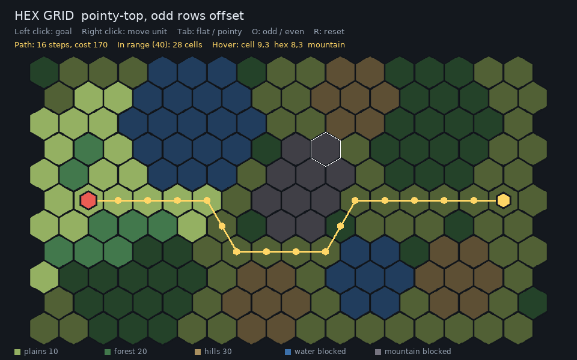

# Hex Grids

`kin/core/hex.hpp` has the coordinate math for hex maps, and
`kin/pathfinding/pathfinding.hpp` searches them. `games/hex_demo` shows both:
picking, a unit's movement range, and A* paths in all four layouts.



## Coordinates

A hex is an axial coordinate `kin::Hex{q, r}`; the third cube coordinate is
`s() == -q - r`. Axial coordinates make the math simple and exact:

```cpp
kin::Hex a{2, -1};
kin::hex_distance(a, {0, 0});        // 2
kin::hex_neighbor(a, 0);             // one step in direction 0
kin::hex_neighbors(a);               // all six
kin::hex_rotate_cw(a);               // 60 degrees about the origin
kin::hex_ring({0, 0}, 3);            // the 18 hexes 3 steps away
kin::hex_range({0, 0}, 2);           // the 19 hexes within 2 steps
kin::hex_line(a, {-3, 4});           // hexes along a straight line
```

`kin::HexDirections` lists the six directions. Each index is 60 degrees
counterclockwise on screen from the previous one, and `d + 3` is the opposite of
`d`. For pointy-top hexes, direction 0 is east; for flat-top hexes, south-east.

## Layouts: pixels and offset cells

A `kin::HexLayout` places hexes on screen and in a rectangular array:

```cpp
kin::HexLayout layout{
    .orientation = kin::HexOrientation::PointyTop, // or FlatTop
    .size = {24.0f, 24.0f},  // center-to-corner radius; unequal values squash
    .origin = {40.0f, 40.0f}, // where hex (0, 0)'s center goes
    .offset = kin::HexOffset::Odd,
};
kin::Vec2f center = layout.to_pixel(hex);
kin::Hex picked = layout.from_pixel(mouse);    // the hex under a point
std::array<kin::Vec2f, 6> corners = layout.corners(hex);
kin::Vec2f box = layout.hex_extent();          // one hex's bounding box
```

Maps are usually stored as `cols x rows` arrays of offset cells `{col, row}`.
`to_offset()` and `from_offset()` convert. With pointy-top hexes every other
row is shifted half a hex right; with flat-top hexes every other column is
shifted half a hex down. `HexOffset::Odd` shifts the odd ones, `Even` the even
ones. These are the four conventions described on
[Red Blob Games](https://www.redblobgames.com/grids/hexagons/). A rectangle of
offset cells forms a rectangle on screen.

## Pathfinding

`kin::HexGridNav` describes a `cols x rows` map of offset cells, with the same
`blocked` and `cost` callbacks as `kin::GridNav`. Costs are for entering a
cell; the default is 10.

```cpp
kin::HexGridNav nav{
    .cols = 40,
    .rows = 30,
    .layout = layout, // only the orientation and offset are used
    .blocked = [&](int col, int row) { return map.is_water(col, row); },
    .cost = [&](int col, int row) { return map.is_forest(col, row) ? 20 : 10; },
};
std::vector<kin::Vec2i> path = kin::find_path(nav, start, goal);
std::vector<kin::HexReach> range = kin::reachable_cells(nav, start, 40);
```

- `find_path` returns the cheapest path from `start` to `goal`, both included, or
  nothing when there is none. Equally cheap paths are broken the same way on
  every run and every platform.
- `reachable_cells` returns every cell the unit can reach with a budget, with its
  cheapest cost: a movement range. Sorted by cost, then row, then column.
- `nav.neighbors(cell)` lists a cell's in-bounds neighbors.

The A* heuristic assumes no step costs less than
`HexPathOptions::min_step_cost` (10). If some cells cost less, pass a lower value,
or the path may not be the cheapest.
