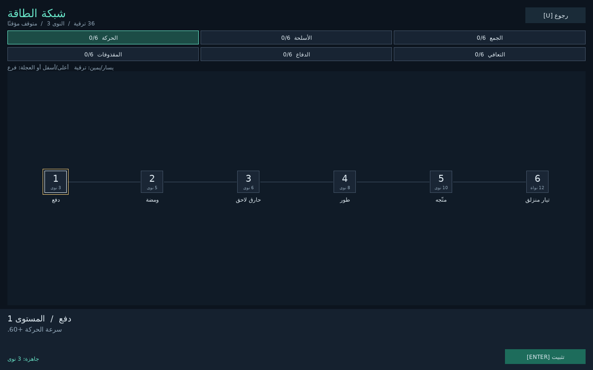

# Localization

Every piece of text a player reads comes from a key, in the language they
chose, and the language can change while the game runs. Translations are data
files that reload as they are edited. A run can report every key it looked up
and did not find.

- `kin/l10n/localization.hpp`: `Localization`, language files, locale tags.
- `kin/l10n/message_format.hpp`: messages with values, plurals and choices.
- `kin/core/bidi.hpp`: the Unicode bidirectional algorithm, for text that
  runs both ways.
- `kin/ui2/text.hpp`: fonts that draw any script, with fallback fonts.



## Start

```cpp
kin::Localization l10n;
std::vector<std::string> errors;
l10n.load_directory(root / "lang", errors, &file_watcher); // en.kinlang, fr.kinlang, ...
l10n.set_locale(kin::system_locales());                     // or the player's saved choice

kin::SceneAppConfig config{/* ... */};
config.localization = &l10n;   // kin::tr, ui2, dialogue and scripts use it
config.file_watcher = &file_watcher;
return kin::run_scene_app(config, scenes);
```

Anywhere in the game:

```cpp
ui.text(l10n.text("menu.play"), pos, style);            // no allocation after the first lookup
ui.text(kin::tr("shop.gold", {{"gold", 1250}}), pos, style); // "1,250 gold", "1 250 pièces d'or"
```

`kin::tr` reads the active localization (`set_active_localization`, which
`run_scene_app` sets from `SceneAppConfig::localization`). Without one it
returns the key.

## Language files

A `.kinlang` file is JSON, one language per file:

```json
{
  "locale": "fr",
  "name": "Français",
  "strings": {
    "menu": { "play": "Jouer", "quit": "Quitter" },
    "shop.gold": "{gold} pièces d'or",
    "hand.cards": "{n, plural, one {# carte} many {# cartes} other {# cartes}}"
  }
}
```

- `locale` is a language tag (`fr`, `pt-BR`, `zh-Hant`). `name` is the
  language's own name, for a language menu. `direction` (`ltr` or `rtl`) is
  optional and follows the tag (Arabic, Hebrew, Persian and Urdu run right
  to left).
- Objects nest with dots: `menu.play`. A key given twice is an error.
- Several files may give one language (`ui.kinlang`, `dialogue.kinlang`).
  Loading a file again replaces what it gave, and a broken edit keeps the last
  good version.

Translators often work in spreadsheets, so CSV loads too, one column per
language:

```csv
key,en,fr,comment
@name,English,Français,
menu.play,Play,Jouer,The main menu's first button
shop.gold,"{gold} gold","{gold} pièces d'or",
```

Columns named `comment`, `context`, `notes` or `description`, or starting with
`#`, are ignored, as are rows whose key starts with `#`. An empty cell is an
untranslated key. `write_language_file` writes a `.kinlang` back out (keys
sorted).

gettext catalogues (`.po`), which most translation tools and services use,
load too:

```po
msgctxt "hand.cards"
msgid "%d card"
msgid_plural "%d cards"
msgstr[0] "%d karta"
msgstr[1] "%d karty"
msgstr[2] "%d kart"
```

An entry's key is its `msgctxt` (or its `msgid` without one) and `msgstr` is a
kin message. Plural entries become `{n, plural, ...}`: each category the
language uses takes the form the header's `Plural-Forms` picks for a number
of it, `%d` becoming `#`. Fuzzy, obsolete and untranslated entries are left
out. `write_gettext(base, &translation)` writes a catalogue for translators
(msgctxt the key, msgid the base text); without a translation, a template.

## Fallback

A key runs down a chain: the locale shown (`fr-CA`), the tags it falls back to
(`fr`), then the base locale (`en` unless `set_base_locale` says otherwise).
`set_locale("fr-BE")` with only `fr` loaded shows `fr`, and `pt-PT` takes
`pt-BR` if that is all there is. A key no language has shows as the key
itself, is logged once (`l10n` category, `missing text`), and is listed by
`missing_keys()`.

## Messages

Text with values in it follows a subset of ICU MessageFormat:

| Pattern | Gives |
|---|---|
| `{gold} gold` | the value; numbers are grouped for the locale (`12,500.5`, `12 500,5`, `12.500,5`) |
| `{n, plural, =0 {none} one {# card} other {# cards}}` | the CLDR category of `n` for the language; `#` is `n`; `=N` matches exactly |
| `{who, select, her {her turn} other {their turn}}` | the branch named by a string value |
| `{place, selectordinal, one {#st} two {#nd} few {#rd} other {#th}}` | an ordinal's CLDR category (`ordinal_category`) |
| `'{name}'` | quoted text: an apostrophe before `{`, `}` or `#` starts it, `''` is one apostrophe |

A plural or select needs `other`, which a missing category falls back to.
Plural rules cover about 45 languages (`plural_categories(locale)` lists the
categories a language uses: Polish needs `one`, `few`, `many` and `other`,
Arabic all six). A value the caller does not give stays as written (`{gold}`),
so the gap shows. `format_message` and `format_number` work without a
`Localization`.

## Checking translations

`validate()` checks every language against the base and returns issues:

- **Errors**: a pattern that does not parse.
- **Warnings**: a key not translated (it shows the base text), a key the base
  lacks, an argument the base does not use or a base argument the translation
  drops, a plural without the categories its language needs.

A test can load the game's files and assert `validate()` is empty, as
`examples/example_tests.cpp` does for Signal Siege.

## Runs and agents

| Flag | Effect |
|---|---|
| `--locale=TAG` | Shows this language, over the game's own choice. |
| `--pseudo-locale` | Shows `en-XA`: the base text accented, a third longer and bracketed, `[Pĺåý ~]`. Plain text was never looked up; cut-off text will not fit a longer language. |
| `--fail-on-missing-text` | Fails the run if any key was missing. |

Headless and server runs without `--locale` show the base language, so they
are the same on every machine. The run report has a `localization` section
with the locale shown and `missing_text`:

```sh
./game --headless --frames 600 --locale=de --fail-on-missing-text --report=-
```

## Retained UI, dialogue and scripts

- **ECS ui2**: `ui2_entity(world).label({}).text_key("menu.play")`, or a
  `Ui2Text{key, args}` component. The widget's text (a label, button, toggle,
  wrapped text, ...) is set from the active localization, and set again, with
  the tree laid out again, when the language changes.
- **Dialogue**: `DialoguePlayer::current_view` shows lines, choices, speaker
  names and history from the localization where it has their keys:
  `dialogue.<document>.<node>`, `dialogue.<document>.<node>.<choice>` and
  `speakers.<speaker>`. The dialogue's variables are the message's values, so
  `"{gold} pièces"` works. `dialogue_language_file(document)` extracts a
  document's own text under those keys: a file for translators to start from,
  and, loaded as the base, what lets `validate()` see untranslated lines.
- **Lua**: `tr("key")`, `tr("key", {gold = 3})` and an `l10n` table
  (`locale()`, `direction()`, `has()`, `format()`, `languages()`, and in
  `ScriptEngine` scripts `set_locale()`).

## Text in every script

TTF fonts (`ui2::load_ttf_font`, `ui2::system_ui_font`) draw any script:

- Characters that do not join or reorder (Latin, Greek, Cyrillic, CJK, ...) are
  laid out glyph by glyph from an atlas that grows as new characters appear,
  kerned as the font says.
- Right-to-left text, and text that needs a shaper (Arabic, Indic scripts,
  combining marks), is ordered by the bidirectional algorithm and shaped by
  HarfBuzz run by run.
- A font may name fallbacks for the characters it lacks:
  `TtfFontOptions{.fallbacks = ui2::system_fallback_fonts()}`. `system_ui_font`
  uses the system's CJK, Arabic, Hebrew, Thai and Devanagari fonts where they
  exist. A shipped game should ship its own fallback fonts.
- `wrap_text` breaks CJK text between characters, never before closing
  punctuation (`。」`) or after an opening bracket.

## Fonts per language

Japanese, Chinese and Korean share code points but draw some characters
differently (直, 骨, 角), so each wants its own font. A font can name fallbacks
by language, tried before its other fallbacks while `ui2::text_language()`
matches:

```cpp
auto font = kin::ui2::load_ttf_font("fonts/Lato.ttf", 16, kin::ui2::TtfFontOptions{
    .fallbacks = {"fonts/NotoSansArabic.ttf"},
    .language_fallbacks = {{"ja", "fonts/NotoSansJP.otf"},
                           {"zh-Hant", "fonts/NotoSansTC.otf"},
                           {"zh", "fonts/NotoSansSC.otf"},
                           {"ko", "fonts/NotoSansKR.otf"}},
});
```

`run_scene_app` sets the text language from the localization, and fonts
switch their fallbacks (and shape with the language) when it changes, so
themes made with them follow without being made again. `FontSource{path, face}`
names a face of a collection (`.ttc`). `system_language_fonts()` finds the
system's: Yu Gothic, Microsoft YaHei, Microsoft JhengHei and Malgun Gothic on
Windows; the matching faces of Noto Sans CJK on Linux. `system_ui_font` uses
them.

## Assets by language

A texture, data file or voice line can have a version per language, at
`l10n/<locale>/<path>` under the asset root:

```
assets/voice/intro.wav            the base language's
assets/l10n/fr/voice/intro.wav    French (and fr-CA, which falls back to fr)
assets/l10n/ja/ui/title.png       Japanese
```

`AssetManager` and `AudioCatalog` look files up through the active
localization (`Localization::localized_path`), so `assets.load<Image>("ui/title.png")`
and a voice cue's clip come in the player's language where the game has
them. A load after a language change gets that language's file; handles kept
from before still hold the old one, so load again when
`Localization::generation()` changes.

## Text input

- **Input methods.** A Japanese, Chinese or Korean player types through an
  IME: `Input::text_composition()` holds what is being composed. `TextInput`
  and `TextEdit` show it at the caret, underlined, and leave the keys to the
  IME until it commits the text. Call `ui.apply_text_input(window)` once a
  frame after `ui.end()`: it starts text input while a field is focused and
  puts the IME's candidate list beside the caret.
- **Right-to-left editing.** Right-to-left text sits at the field's right
  edge, the caret moves leftwards through it, and selections split where
  directions mix. The arrow keys move the caret on screen, through text that
  runs both ways (Ctrl steps by word through the text). `ui2::caret_x`,
  `caret_at`, `caret_move` and `selection_spans` do this for any line, for
  editors of a game's own.

## Text that does not fit

Translations run longer than English. A `Label` or `Button` can cut its text
with an ellipsis (`TextOverflow::Ellipsis`) or shrink it to fit, to 70%, and
then cut (`TextOverflow::Shrink`); `ui2::fit_text` does the same for text a
game draws itself.

Text that overflows its widget is listed in the run report under
`ui_overflow` (widget, text, width it had and width it wanted), and
`--fail-on-text-overflow` fails the run. With the pseudo-locale this finds
the layouts a longer language will break:

```sh
./game --headless --frames 600 --pseudo-locale --fail-on-text-overflow --report=-
```

Text drawn at a position rather than in a widget has no bounds to overflow.

## Right-to-left interfaces

`run_scene_app` keeps `ui2::set_ui_direction` in step with the language shown.
For a right-to-left language it:

- reflects ui2 layouts, so rows run from the right and children mirror inside
  their parents;
- swaps `Start` and `End` in `align_rect`;
- makes text paragraphs right to left (`ui2::set_text_base_direction`).

Widgets with a left and a right mirror their insides: a checkbox's box goes
to the right of its label, sliders and progress bars fill from the right, tabs
and menus run from the right, and a scroll view's scrollbar is on the left.
Text and images inside still read the right way round. A widget of a game's
own can do the same with `ui.mirror_if_right_to_left(bounds)`. Popups are
placed as their left-to-right selves reflected about their anchor: a dropdown
aligns to its anchor's right edge, a submenu opens to the left. UI drawn at
fixed positions (a HUD placed by hand) is not moved.

## Choosing the language

Pick the player's language once, then keep their choice:

```cpp
const std::string saved = settings.string_at("locale");
if (saved.empty()) {
    l10n.set_locale(kin::system_locales()); // the system's preference list
} else {
    l10n.set_locale(saved);
}
```

A language menu lists `l10n.languages()` by `name`, calls `set_locale` and
saves `l10n.locale()`. Signal Siege's title (`examples/siege_scenes.cpp`) does
this, with its text in `examples/content/lang/` in English, French, Japanese and
Arabic.

## Limits

- A `TextEdit` lays a right-to-left paragraph out by its first strong
  character for the whole text, not per paragraph.
- Shaped runs are drawn from a texture each, kept in a cache; they have no
  distance-field outline (an outlined one is stamped).
- Isolates (U+2066-2069) are treated as embeddings, and brackets are not
  paired (UAX #9 N0).
