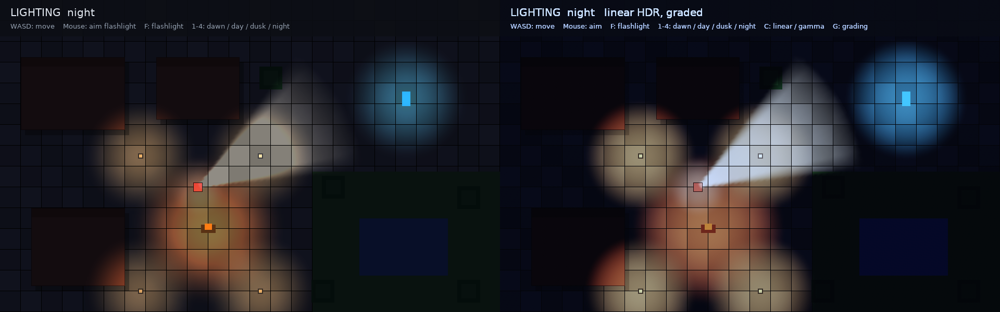

# Rendering And Sprites

## Sprite References

ECS rendering uses sprite references instead of storing concrete sprite/texture
data in components.

```cpp
kin::SpriteCatalog catalog;
catalog.set_texture("actors", "actors.png", texture);
catalog.add_sheet({
    .id = "actors.sheet",
    .texture_id = "actors",
    .grid = {.tile_w = 16, .tile_h = 16},
});
catalog.add_sheet_sprite("hero.walk.0", "actors.sheet", 0);

entity.set(kin::SpriteRenderer{
    .sprite = catalog.ref("hero.walk.0"),
});
```

The reference chain is:

```text
SpriteRenderer -> SpriteRef(sprite id)
SpriteCatalog -> SpriteDefinition
SpriteDefinition -> texture_id or sheet_id + frame
SpriteSheetDefinition -> texture_id + grid
TextureAssetRef -> asset path + loaded Texture
```

Concrete `Sprite` values still exist for low-level rendering and UI image
helpers, but ECS/editor-facing rendering should prefer ids.

## Layers And Placement

ECS sprite rendering composes placement in this order:

```text
anchor = world_transform(catalog_sprite.offset + SpriteRenderer.offset)
top_left = anchor - pivot * final_size * |world scale|
rotation = world rotation + SpriteRenderer.rotation, about the anchor
```

`final_size` uses `SpriteRenderer.size` when set, otherwise the catalog sprite
size. `pivot` uses `SpriteRenderer.pivot` when it is non-negative, otherwise the
catalog sprite pivot. With an unturned, unscaled entity the anchor is its
position plus the offsets.

### Mirroring

`SpriteRenderer::flip_x` and `flip_y` (and `TextureRenderer`'s) mirror the
image left-right and upside down about its pivot, which stays put: a hero with
its pivot at its feet turns to face left on the spot. A negative world scale on
an axis mirrors it the same way, and a flag and a negative scale on the same
axis cancel out. The flags are animatable (`SpriteRenderer.flip_x`, ...).

```cpp
hero.get_mut<kin::SpriteRenderer>()->flip_x = velocity.x < 0.0f; // face where it walks
```

Below the ECS, `kin::Flip` (`None`, `X`, `Y`, `XY`) is the last argument of
`Renderer2D::draw_texture` / `draw_sprite`, of `RenderQueue::draw_texture`,
`draw_sprite` and `draw_texture_region`, and a field of `SpriteInstance`: the
image is mirrored within `dest`, then turned about the pivot. Backends see a
flipped draw as a source rectangle read from the far side (`kin::mirrored()`:
a negative width or height), so it batches with unflipped sprites of the same
texture; the SDL renderer's unbatched path turns it into `SDL_FlipMode`.

Named layer helpers keep ordering stable:

```cpp
renderer.layer = kin::layer_value(kin::RenderLayer::Actors, 5);
renderer.y_sort = true;
renderer.sort_y_offset = 12.0f;
```

Catalogs can be saved as `.kinsprites` text assets:

```text
texture actors actors.png
sheet actors.sheet actors 16 16 0 0
sheet_sprite hero.walk.0 actors.sheet 0 24 24 0.5 1 0 0
sprite hero.icon actors 0 0 16 16 24 24 0.5 1 0 0
```

Use `save_sprite_catalog(...)` and `load_sprite_catalog(...)` for roundtrips.
The renderer-backed load overload can create textures from image assets:

```cpp
kin::SpriteCatalog catalog = kin::load_sprite_catalog(assets, renderer, "hero.kinsprites");
```

## Transforms And Cameras

### Entities and the flecs hierarchy

`Transform2D` places an entity relative to its parent (flecs `ChildOf`), or to
the world without one: scaled (`scale`, per axis), then turned (`rotation`, in
degrees, clockwise), then moved to `pos`. `WorldRenderState::propagate_transforms()`
composes them into `WorldTransform` through a cached flecs `cascade` query, so
parents are done before their children and each table (one parent) is a tight
loop:

```cpp
kin::EcsEntity ship = world.entity("ship").set(kin::Transform2D{.pos = {100, 100}, .rotation = 30});
kin::EcsEntity turret = world.entity("turret").set(kin::Transform2D{.pos = {12, 0}});
turret.child_of(ship);   // turret sits 12 units along the ship's nose, turned with it
```

Renderer offsets and sizes, line ends and rectangles go through the entity's
world transform. A turned parent's scale stays along the child's own axes (no
shear), and a negative scale draws a sprite at its size, unmirrored.
`kin::world_transform(entity)` composes the chain on demand when no
`WorldRenderState` has run; `kin::compose(parent, child)` is one step.

### Drawing through a transform

`Renderer2D::push_transform(m)` / `pop_transform()` / `scoped_transform(m)`
map everything drawn until the pop by `m` (a `kin::Affine2`), then by any
transform pushed before it. Shapes are transformed as if drawn and then moved,
turned and scaled: a line or an outline one unit wide grows with the scale.
The vertices are mapped on the CPU, so draws keep batching across transform
changes; sprite batches stay instanced under rotation and even scale.
Viewports, clips, `capture_backdrop` and `read_rgba` stay in untransformed
coordinates. A render target starts untransformed and the transform returns
when it is popped; layers keep it. Both backends support it
(`capabilities().transforms`).

```cpp
{
    const auto spin = renderer.scoped_transform(kin::Affine2::translation(center) *
                                                kin::Affine2::rotation(angle) *
                                                kin::Affine2::translation({-center.x, -center.y}));
    draw_dial(renderer);
}
```

### Cameras

`Camera2D` has `zoom` (screen units per world unit) and `rotation` (degrees,
clockwise: the camera turns, so the world turns the other way), both about the
viewport's centre. `center()` and `look_at(world)` move it by that point;
`offset` is still the world point at the top-left corner of an unzoomed,
unturned camera. `view_transform()` is world to screen as an `Affine2`;
`world_to_screen`, `screen_to_world` and `visible_rect` (the box around what is
shown, for culling) follow zoom and rotation.

A `RenderQueue` flushed with a `RenderView` whose camera zooms or turns draws
through `view_transform()`; one that only moves shifts each command as before.
Output-pixel commands and `Text` / `Custom` callbacks draw without the camera
either way: draw world coordinates in a callback with
`renderer.scoped_transform(camera.view_transform())`.

## Shapes


Vector shapes are drawn anti-aliased, crisp at any zoom or turn, two ways:

- **Primitives** (circles, ellipses, rounded and sharp rectangles, capsules)
  are drawn whole on SDL_GPU: one quad each, the outline computed per pixel
  from its distance, fill and stroke together.
- **Everything else** is tessellated into triangles: each outline gets a thin
  soft edge whose vertices carry their distance past it, faded over one
  screen pixel by the shape shader.

The SDL_Renderer fallback tessellates primitives too, pulls soft edges in to a
pixel on the CPU and fades them with vertex alpha.

### Drawing as you go

```cpp
renderer.fill_circle({100, 100}, 20, kin::colors::white);
renderer.draw_circle({100, 100}, 24, accent, 2.0f);
renderer.draw_line(a, b, accent, 4.0f, kin::LineCap::Round);
renderer.draw_polyline(points, ink, {.width = 3, .join = kin::LineJoin::Round});
renderer.draw_arc(center, 30, -90, 45, gold, {.width = 6, .cap = kin::LineCap::Round});
renderer.fill_path(kin::Path::star(center, 20, 8, 5), gold);
```

Also `fill_ellipse`, `draw_ellipse`, `fill_polygon`, `draw_polygon`,
`fill_pie` and `stroke_path`. Circles, ellipses, `fill_rounded_rect`,
`draw_rounded_rect` and `draw_line` with a width are primitives: cheap to draw
as you go. The rest tessellate each call; for those drawn every frame, make a
mesh once instead.

### Paths

`kin::Path` holds lines, quadratic and cubic curves, SVG arcs and closes, with
helpers for rectangles, rounded rectangles, circles, ellipses, polygons,
polylines, arcs, pies, regular polygons and stars. `Path::parse_svg("M0 0 L10 0
...")` reads SVG path data, every command; `to_svg()` writes it. Curves are
flattened to a tolerance (a quarter unit by default) with as few segments as
that allows.

Fills take SVG's `NonZero` and `EvenOdd` rules, holes and islands included
(subpaths that cross each other are each filled whole). Strokes have a width,
`Miter` (with `miter_limit`), `Round` or `Bevel` joins, and `Butt`, `Round` or
`Square` caps; a zero-length subpath under a round or square cap is a dot.

### Composing shapes

A `kin::Shape` is a list of elements, each a path with a fill, a stroke, a
transform and an id. Shapes are made of shapes: `add(other, transform)` places
another shape's elements.

```cpp
kin::Shape wheel;
wheel.fill(kin::Path::circle({0, 0}, 10), tyre)
     .fill(kin::Path::circle({0, 0}, 4), hub);
kin::Shape cart;
cart.fill_and_stroke(kin::Path::rounded_rect({-30, -20, 60, 24}, 4), paint, ink, {.width = 2})
    .add(wheel, kin::Affine2::translation({-18, 6}))
    .add(wheel, kin::Affine2::translation({18, 6}));

const kin::ShapeMesh mesh = cart.mesh();          // tessellate once
renderer.draw_shape(mesh, kin::Affine2::translation(pos) * kin::Affine2::rotation(angle), tint);
```

`ShapeBuildOptions` sets the curve tolerance and the soft edge's width in shape
units (2 by default, enough for drawing down to half size; the edge stays one
pixel wide however large the mesh is drawn). `ShapeMesh::append(mesh,
transform)` merges meshes into one. Stroke widths scale with their element's
transform, as in SVG.

A path made by `Path::rect`, `rounded_rect`, `circle` or `ellipse` (and SVG's
`<rect>`, `<circle>` and `<ellipse>`) remembers it (`Path::primitive()`), and
`Shape::mesh` keeps such an element as a primitive, in paint order with the
triangles (`ShapeMesh::runs`). Two strokes stay triangles: a bevelled sharp
corner, and an ellipse's stroke thicker than half its smaller radius (its
distance is estimated, close only near the outline). `write_svg` writes
primitives back as `<rect>`, `<circle>` and `<ellipse>`.

### SVG-lite

`kin::read_svg` / `load_svg` read what vector editors export for flat-coloured
artwork into a `Shape`, and `write_svg` / `save_svg` write a Shape any browser
opens:

- elements: `<svg>` (viewBox), `<g>`, `<path>`, `<rect>` (with `rx`, `ry`),
  `<circle>`, `<ellipse>`, `<line>`, `<polyline>`, `<polygon>`, and `<defs>`,
  `<symbol>` and `<use>` for reuse;
- the `transform` attribute, and `fill`, `fill-rule`, `fill-opacity`,
  `stroke`, `stroke-width`, `stroke-linejoin`, `stroke-linecap`,
  `stroke-miterlimit`, `stroke-opacity`, `opacity`, `color`, `display` and
  `visibility`, as attributes or in `style=""`, inherited through groups;
- colours as `#rgb`, `#rgba`, `#rrggbb`, `#rrggbbaa`, `rgb()`, `rgba()`, the
  basic names and `currentColor`.

What is not read (gradients and patterns, text, images, masks, clip paths,
filters, `<style>` sheets, dashes, units other than px) is listed in the
`warnings` argument, and the rest of the file still reads. A group's opacity is
multiplied into its elements' colours rather than composited as a group.

### In the ECS

`kin::ShapeRenderer{.mesh = shared_mesh}` draws a mesh at its entity. Unlike the
sprite renderers it takes the whole world transform, so it turns, scales
unevenly and mirrors (a negative scale) with the entity and its parents. It
sorts (`layer`, `order`, `y_sort`), culls and follows cameras like the other
renderers, and many entities can share one mesh. `RenderQueue::draw_shape`
queues a mesh directly. `games/shapes_demo` is an orrery: planets and moons
turning with their parents, shapes composed in code and a rocket read from
SVG-lite, a zooming and turning camera.

### Cost

Primitives are one 56-byte instance each; triangles draw indexed, 16 bytes a
vertex; both batch across transforms. `kin_draw_bench 200 2000 shapes` draws
2000 tokens a frame, each a filled and stroked circle with a star on it
(RTX 4080 Laptop):

| | CPU to record | GPU |
|---|---|---|
| cached mesh, drawn 2000 times | 0.88 ms | 0.9 ms |
| one merged mesh | 0.83 ms | 0.9 ms |
| drawn as you go (the star tessellated each time) | 5.6 ms | 0.9 ms |

The token is 1 primitive plus 20 vertices and 28 triangles for the star; as
triangles alone it was 140 vertices and 206 triangles, and the cached mesh took
3.5 ms. Tessellating 200 tokens takes 0.54 ms: make meshes once and draw them
many times.

## Animation

Sprite animation is driven by the general animation system. Sprite frames are
authored as `SpriteTrack` keys inside `Animation` definitions and resolved
through an `AnimationRegistry`.

```cpp
auto fragment = assets.load<kin::AnimationRegistryFragment>("hero.kinanim");

kin::AnimationRegistry animations;
animations.merge(*fragment);

entity.set(kin::AnimationPlayer{
    .registry = &animations,
    .properties = &properties,
    .catalog = &catalog,
});

auto* player = entity.get_mut<kin::AnimationPlayer>();
kin::set_base(*player, "hero.walk");
```

Run animation before rendering:

```text
advance_animation_players(world, dt)
sample_animation_players(world)
animation_events.run(world)
```

Animation assets support `Clip`, `Ref`, `Sequence`, `Parallel`, and `Repeat`
nodes, per-frame pivots, event keys, and per-frame `SpriteBox` hitboxes and
hurtboxes.

```text
animation hero.attack
  clip 0.12
    sprite hero.attack.0 0
    sprite hero.attack.1 0.06 pivot 0.25 0.75
    event 0.06 sound name=sfx value=slash offset 0 -8
```

Raw imported frame rectangles can be expanded into sprite ids and concrete
animations:

```cpp
kin::AnimationImportSet import{
    .texture_id = "actors",
    .texture_path = "actors.png",
    .clips = {{
        .name = "hero.walk",
        .frames = {
            {.source = {0, 0, 16, 16}, .duration = 0.1f},
            {.source = {16, 0, 16, 16}, .duration = 0.1f},
        },
    }},
};

kin::AnimationRegistry animations;
kin::add_animation_sprites(catalog, assets, renderer, import, {.id_prefix = "player"}, &animations);
```

## Animation State Machines

`AnimationStateMachine` maps state names to animation ids and evaluates
bool/float/trigger parameters on each `AnimationPlayer`.

```cpp
auto machine = std::make_shared<kin::AnimationStateMachine>();
machine->initial = "idle";
machine->states["idle"] = "hero.idle";
machine->states["run"] = "hero.run";
machine->transitions.push_back({
    .from = "idle",
    .to = "run",
    .conditions = {{.param = "moving", .op = kin::CondOp::BoolEqual, .bool_value = true}},
    .mode = kin::TransitionMode::ReplaceBase,
});

player.machine = machine;
player.params.set_bool("moving", true);
```

State-machine evaluation runs at the start of `advance_animation_players(...)`.

State machines can be saved as `.kinanimsm` text assets:

```text
statemachine hero
  initial idle
  state idle hero.idle
  state run hero.run
  transition idle -> run when bool:moving == true mode replace
  transition run -> idle when bool:moving == false mode replace
```

## Custom Shaders

A material shader is a fragment shader drawn over a rectangle. Create it once
from precompiled bytecode, then draw it with `draw_shader_surface()`:

```cpp
kin::ShaderDesc desc;
desc.spirv = {bytes.data(), static_cast<kin::u32>(bytes.size())};
desc.num_samplers = 3;        // texture slots the shader declares
desc.num_uniform_buffers = 1; // ShaderParams, when the shader has a uniform block
kin::ShaderHandle shader = renderer.create_shader(desc);

const std::array<kin::Texture, 3> sources{albedo, heights, shadows};
kin::ShaderParams params;
params.uniforms[0] = time;
renderer.draw_shader_surface(rect, shader, params, sources);
```

`sources[i]` binds at fragment sampler slot `i`, up to `kin::MaxShaderSamplers`
(16). In GLSL that is `layout(set = 2, binding = i) uniform sampler2D ...`, and
the uniform block is `layout(set = 3, binding = 0)`. Slots the shader declares
but the draw does not fill are bound to a 1x1 white texture. Overloads taking no
texture, one texture, or two textures are shorthands for the same call.

`create_shader()` reads the SPIR-V itself (`kin::reflect_spirv`, about 10 µs):
the texture, storage buffer and uniform block counts come from the shader, so a
`ShaderDesc`'s may be left alone (one that disagrees is logged, and the
shader's used). Its uniform block can then be set by member name:

```cpp
kin::ShaderParams params = renderer.shader_params(shader); // sized, with the layout
params.set("strength", 0.5f);
params.set("tint", std::array{1.0f, 0.8f, 0.6f, 1.0f});
```

`ShaderParams::uniforms` holds 16 floats by default. Resize it for more, up to
`kin::MaxShaderUniformFloats` (4096, 16 KiB). Declare arrays in the shader as
`vec4`s: std140 pads each element of a `float` array to 16 bytes.

### Editing shaders while the game runs

During development a shader can be loaded from its GLSL source and reloaded
whenever the file is saved, keeping its handle:

```cpp
kin::ShaderFile lava{renderer, "shaders/lava.frag.glsl"};
// each frame:
lava.poll();                                  // recompiled and reloaded when saved
renderer.draw_shader_surface(rect, lava.handle(), params);
```

It compiles with `glslc` (the Vulkan SDK's: the one kin was built with, or
`KIN_GLSLC`), about 0.1 s a save; the reload itself takes ~0.02 ms. An edit
that does not compile is logged (`ShaderFile::error()`) and the last good
shader kept. `kin::compile_glsl()` compiles a file directly, and
`Renderer2D::reload_shader()` replaces any shader in place. Shipped games load
precompiled SPIR-V.

### Pipelines

The GPU needs a pipeline for each combination of shader, blend mode, target
and vertex layout, and making one costs about 0.5 ms, or up to ~20 ms on a cold
driver cache (first launch, new driver): a hitch on the frame that first draws
it. So:

- `create_shader()` makes the shader's usual pipeline (alpha blend, an RGBA8
  target) at once.
- `Renderer2D::pipeline_record()` lists the pipelines a run made, and
  `prewarm_pipelines(record)` makes them while the next run loads: the engine's
  own at once, a game's as its shader is created (shaders are known across runs
  by their SPIR-V's hash). `run_scene_app` does this for windowed runs, keeping
  the record in the user data folder (`kin/<window title>/pipelines.txt`, or
  `SceneAppConfig::pipeline_record_path`; an empty path keeps none).

On an RTX 4080 Laptop GPU with a cold driver cache, the first frame drawing a
shader as triangles with `BlendMode::Max` took 10 ms without a record and
0.8 ms with one (the pipeline was made during loading instead).

### Shader geometry

`draw_shader_surface()` covers a rectangle. For a shape that is really a
polygon (a shadow, a hull, a beam), `draw_shader_geometry()` draws triangles
with the same material shader, so the rasterizer decides what is inside and
only the covered pixels run the shader:

```cpp
std::vector<kin::ShaderVertex> vertices;
std::vector<kin::u32> indices;            // three per triangle; empty: vertices are triangles
for (const Shadow& s : shadows) {
    const auto first = static_cast<kin::u32>(vertices.size());
    for (const kin::Vec2f p : s.hull) {
        vertices.push_back({.position = p, .uv = s.uv_of(p), .custom = {s.index, s.height, 0, 0}});
    }
    for (kin::u32 i = 1; i + 1 < s.hull.size(); ++i) {   // a fan over the convex hull
        indices.insert(indices.end(), {first, first + i, first + i + 1});
    }
}
const auto max = renderer.scoped_blend_mode(kin::BlendMode::Max);
renderer.draw_shader_geometry(vertices, indices, shadow_shader, params, sources);
```

- The fragment shader gets `color` and `uv` as for a surface, and each vertex's
  `custom` as `layout(location = 2) in vec4`. One draw can then carry many
  shapes, each with its own parameters, such as an index into a data texture.
- Sources, params and the blend mode work as for `draw_shader_surface()`. With
  `BlendMode::Max`, overlapping shapes combine by the larger, in any order.
- Geometry that isn't whole triangles, or indexes past the vertices, is refused
  and logged; nothing is drawn.
- It needs `capabilities().shader_geometry`: the SDL_GPU backend has it, others
  draw nothing.

### Costly effects at lower resolution

`draw_shader_surface_scaled(resolution, rect, shader, params, ...)` runs the
shader into a pooled render target `resolution` times the size each way, then
stretches it over `rect` with linear filtering. For smooth effects (fog, glow,
soft light) the picture is the same and the cost a fraction: a full-screen
effect at 1280 x 720 took 1.04 ms at full resolution, 0.32 ms at half and
0.16 ms at a quarter, differing by under 0.1/255 a channel on average
(`kin_draw_bench 60 1 scaled`). The shader must work from its UV, not
`gl_FragCoord`.

### Data buffers

Per-object data a shader reads by index can be a storage buffer instead of a
data texture: an array of structs, with no texel format to pack into and no
16,384-row limit.

```glsl
layout(std430, set = 2, binding = 1) readonly buffer Casters { vec4 casters[]; }; // after 1 sampler
```

```cpp
kin::DataBuffer casters = renderer.create_data_buffer(count * sizeof(Caster), data);
renderer.update_data_buffer(casters, 0, count * sizeof(Caster), data);   // or write_data_buffer
renderer.draw_shader_geometry(vertices, indices, shader, params, sources,
                              std::span<const kin::DataBuffer>{&casters, 1});
```

Buffers bind after the shader's textures in set 2 (`kin/renderer/data_buffer.hpp`),
go up with the frame's texture uploads, and need `capabilities().data_buffers`
(SDL_GPU). A draw given fewer buffers than its shader reads is skipped and
logged. Read speed matches a data texture (`kin_draw_bench 80 1 data`: 1000
objects of 64 floats, 64 reads a pixel, about 0.15 ms either way).

### Compute shaders

Work that is the same small sum at every texel (light or fog fields, flow
fields, coverage) can run on the GPU straight into a texture that later draws
sample, instead of being computed on the CPU and uploaded:

```glsl
layout(local_size_x = 8, local_size_y = 8) in;
layout(std430, set = 0, binding = 0) readonly buffer Lights { vec4 lights[]; };
layout(set = 1, binding = 0, r32f) uniform writeonly image2D field;
layout(set = 2, binding = 0) uniform Params { vec4 count; };
```

```cpp
kin::ComputeShaderHandle shader = renderer.create_compute_shader(spirv);  // layout read from it
kin::Texture field = renderer.create_storage_texture({512, 512}, kin::TextureFormat::R32Float);
renderer.dispatch_compute(shader, {512, 512}, {.buffers = {&lights, 1}, .outputs = {&field, 1}, .params = &params});
renderer.draw_shader_surface(rect, lighting, {}, std::span<const kin::Texture>{&field, 1});
```

Set 0 holds what the shader reads (sampled `sources`, then read-only
`buffers`), set 1 what it writes (`outputs`, then `output_buffers`), set 2 the
uniform block. The dispatch records in the frame between the draws around it.
`capabilities().compute` (SDL_GPU). A 512 x 512 field of 64 lights took
48.5 ms on the CPU (one core) and under 0.1 ms on the GPU, with 0.08 ms of CPU
to record (`kin_draw_bench 30 1 compute`).

### Data textures

Besides `Rgba8`, textures can hold numbers for shaders to read:

```cpp
std::vector<std::uint16_t> heights(cols * rows);    // one 16-bit value per cell
kin::Texture height_map =
    renderer.create_texture({cols, rows}, kin::TextureFormat::R16Uint, heights.data());
renderer.update_texture(height_map, {x, y}, {1, 1},
                        reinterpret_cast<const kin::u8*>(&new_height));
```

| Format | Bytes per texel | GLSL |
| --- | --- | --- |
| `R16Uint` | 2 | `usampler2D`, `.r` |
| `Rg16Uint` | 4 | `usampler2D`, `.rg` |
| `R32Float` | 4 | `sampler2D`, `.r` |

Read them with `texelFetch(tex, ivec2(x, y), 0)`: they are never filtered.

On SDL_GPU, `create_texture()` and `update_texture()` don't each submit their
own command buffer: a frame's uploads are recorded into one, sent to the GPU
just before the frame (or a read-back), so updates made during a frame apply
to the whole frame. Replacing a whole texture that the frame hasn't drawn yet
cycles its storage, so the upload doesn't wait for earlier frames still reading
it. Texels are copied with streaming stores (the staging memory is uncached),
and with `Renderer2D::set_job_system()` uploads of 1 MB or more are copied on
the workers too. Released textures are kept a few seconds (up to 256 MB) and
reused by `create_texture()` for one of the same size and format, skipping the
driver's create and destroy.

An empty texture (`create_texture()` with no pixels) is cleared on the GPU
rather than sent zeros. Draws send little: a quad is four corners (20 bytes
each) drawn through an index buffer made once, and shaders and textures stay
on the GPU, so a frame's traffic is its geometry and whatever textures change.

Texels made each frame can skip the copy altogether: `write_texture()` hands
its callback the upload memory itself to write them into.

```cpp
renderer.write_texture(shadow_data, {0, 0}, {1024, rows}, [&](std::span<kin::u8> texels) {
    auto* out = reinterpret_cast<float*>(texels.data());
    for (const Caster& c : casters) {   // in order, once: the memory is uncached
        *out++ = c.height;
    }
});
```

The callback must not use the renderer. On other backends it writes a buffer
that is then uploaded as by `update_texture()`. `backend_stats().texture_uploads` and `texture_upload_submits`
count them; `kin_upload_bench [frames] [workers] [big]` measures them.

CPU time per frame on an RTX 4080 Laptop GPU (kin 0.2.3, which submitted each
upload on its own, took about 25 ms for the first row and then stalled 70 ms at
present):

| Uploads a frame | No job system | 3 workers |
| --- | --- | --- |
| 50 created and 50 replaced (256 KB each), 50 half updated | 2.1 ms | 2.1 ms |
| 4 created and 4 replaced (16 MB each), 4 half updated | 11.4 ms | 4.6 ms |
They need `capabilities().data_textures` (the SDL_GPU backend), are only for
shaders (`draw_texture()` refuses them), and every slot that expects one must be
given one, since an empty slot is bound to the white `Rgba8` texture.

Shaders need `capabilities().materials_2d`. The SDL_GPU backend supports all of
the above. The SDL renderer's `gpu` driver draws shader surfaces without source
textures, and other backends draw nothing, so check the capability and provide a
fallback. `engine/shaders/` has working examples.

## Layers

Shapes that must combine before they are laid over the scene (shadows that
darken once where they cross, parts of one piece of art that must not show
through each other) go in a layer:

```cpp
{
    const auto shadows = renderer.begin_layer({.opacity = 0.6f, .resolution = 0.5f});
    for (const Building& b : buildings) {
        draw_shadow(renderer, b);   // same coordinates, clips and viewport as outside
    }
}   // laid over the scene here, once
```

- The layer is a pooled render target. Draws inside use the coordinates they
  would outside, so code moves into a layer unchanged.
- Only the box around what was drawn is laid over (and counted as overdraw),
  not the whole target: sparse layers cost what they cover.
- `resolution` below 1 draws soft content at a fraction of the pixels.
- `blend` sets how the layer is laid over (`Alpha` by default). Layers nest.

In `kin_draw_bench 200 1 layers` (four layers of 30 shadows on a 2560 x 1440
screen), whole-screen targets shaded 15.9 Mpixels a frame, `begin_layer` 2.3,
and at half resolution 1.4. SDL_GPU and SDL's renderer (which keeps no
bounds, so lays over all of its layers); elsewhere the draws go straight to
the current target and the opacity is not applied.

## Clips And Masks

What is drawn can be cut to a rectangle, a path or a mask: anything drawn,
read as how much of each pixel shows. All of them go on one stack, and
`pop_clip()` (or a guard going) pops whichever is on top.

```cpp
{   // a portrait in a round frame, anti-aliased, under the camera like the rest
    auto clip = renderer.scoped_clip(kin::Path::circle(centre, 40.0f));
    renderer.draw_texture(portrait, frame);
}
{   // the level only where a light texture is bright
    auto lit = renderer.scoped_mask([&](kin::Renderer2D& r) { r.draw_texture(light, light_rect); },
                                    {.source = kin::MaskSource::Luminance});
    draw_level(renderer);
}
{   // everything but a sprite's silhouette
    auto cut = renderer.scoped_mask(hero_texture, hero_rect, {.mode = kin::MaskMode::Stencil, .invert = true});
    draw_fog(renderer);
}
```

| Call | Cuts to |
| --- | --- |
| `push_clip(rect)` | a rectangle, untransformed, to whole pixels: the scissor, free |
| `push_clip(path, rule, edge)` | inside a path, under the transform: anti-aliased, or `ClipEdge::Hard` |
| `push_mask(draw, options)` | whatever `draw` draws: shapes, sprites, text, a render target |
| `push_mask(texture, dest, options)` | a texture stretched over `dest` |
| `push_clip(region)` | any of these as a `kin::ClipRegion` value (`to_rect`, `to_path`, `to_mask`, `to_texture`) |

`MaskOptions` says how the mask is read:

- `source`: its `Alpha` (a shape, a silhouette), or its `Luminance` (white
  shows, black hides, as SVG's masks).
- `mode`: `Alpha` multiplies by it (soft edges, fades); `Stencil` shows all or
  nothing, where it reaches `threshold` (cut-outs from a texture's alpha).
- `invert`: show what is outside it instead.
- `resolution`: below 1 for soft masks over soft content, at a fraction of the
  pixels.

Clips and masks nest, each within those open: a pixel shows as far as all of
them let it. Masks drawn inside a layer, a render target or another mask work
as anywhere else.

A hard edge (`ClipEdge::Hard`) keeps each pixel whose centre is inside the
path and drops the rest: no soft edge, but on SDL_GPU no layers either (see
below). Use it for pixel art, and wherever many clips a frame matter more than
smooth corners.

### Queued and in the ECS

A sorted `RenderQueue` reorders commands by their keys, so a clip cannot just
be pushed before some of them and popped after. Clipped content goes in a
group instead: a queue of its own, drawn as one command at the group's key,
through its clip.

```cpp
auto panel = std::make_shared<kin::RenderQueue>(kin::RenderSortMode::LayerThenOrder);
panel->draw_sprite(...);   // sorted among themselves by their own keys
queue.draw_group({.layer = ui_layer, .order = 3}, panel,
                 kin::ClipRegion::to_path(kin::Path::rounded_rect(frame, 12.0f)));
```

The clip is in the queue's coordinates: under the camera, when the queue is
flushed with one. A group whose clip has bounds is culled by them; its content
is culled as it draws. Groups nest.

In the ECS, `kin::ClipGroup` on an entity clips its renderers and every
entity's below it (ChildOf), in its own space, so the clip moves, turns and
scales with it. Its subtree draws as one group at the ClipGroup's layer and
order:

```cpp
window.set(kin::ClipGroup{.clip = kin::ClipRegion::to_path(kin::Path::rounded_rect({-60, -40, 120, 80}, 12)),
                          .order = 10});
```

Groups below groups nest. Clipped renderers are collected with the dynamic
ones (`collect_dynamic_world`), whatever their `static_renderable` says.

ui2 widgets clip with `Context::push_clip(bounds, corner_radii)`: the list,
table and tree bodies keep their scrolled rows inside the panel's rounded
corners (only the corners the body touches).

### How they are drawn, and what they cost

A rectangle is the scissor. A path or a mask draws through two pooled layers:
the mask is drawn into one, what it masks into the other, and the second is
laid over through the first, only where the mask was drawn (unless inverted).
A path that is a rectangle and stays one under the transform clips as a
rectangle.

On SDL_GPU (`capabilities().stencil_clips`) hard clips need no layers: the
path's triangles are drawn into the target's stencil buffer, counting at each
pixel how many clips it is inside, and what follows draws only where the count
is full; popping draws them again to count back. Stencil-mode masks (not
inverted) keep their mask layer but read it into the stencil, so what they
mask draws straight on. The stencil buffer, one per target size, is pooled
and attached only to the passes that clip. Elsewhere a hard clip is a
stencil-mode mask of the path, with the same pixels.

In `kin_draw_bench 200 50 masks` (50 cards of 40 quads each on a 1920 x 1080
screen), recording the frame took 0.12 ms unclipped, 0.11 ms with rectangle
clips, 1.15 ms with rounded-rectangle clips (about 20 microseconds of CPU for
each mask, mostly for the render passes its layers begin and end) and 0.31 ms
with hard ones (about 4 microseconds, tessellating each). Prefer rectangles
where they will do and hard edges where they look right; a few dozen smooth
masks a frame are fine.

`capabilities().masks`: SDL_GPU lays masks over in a shader. SDL's renderer
does it by blending for alpha masks (inverted or not, as path clips are),
about 0.08 ms a mask on its GPU drivers; luminance and stencil masks, and its
software renderer, read the layers back and multiply on the CPU, over the
mask's bounds where they are known (paths and textures) and the whole target
otherwise. Elsewhere a path clips to its bounds and a mask lets everything
through, with a warning.

## Cached Targets

A render target whose content changes rarely (a minimap, an icon, a panel, a
static part of the world) can be drawn again only when it does:

```cpp
kin::CachedTarget minimap;
// each frame:
if (minimap.stale(renderer, size, kin::cache_key(camera.x, camera.y, map.version()))) {
    const auto bind = renderer.scoped_render_target(minimap.target());
    renderer.clear(kin::Color::rgba(0, 0, 0, 0));
    draw_minimap(renderer);
}
renderer.draw_texture(minimap.texture(), rect);
```

`stale()` is true the first time, when the size or the key changes, or after
`invalidate()`; `kin::cache_key(...)` hashes plain values into a key.
`reuses()` and `redraws()` count how it went. In `kin_draw_bench 200 1
cached`, a 288 x 288 target of 44 layers cost 4.3 Mpixels and 0.5 ms of CPU a
frame drawn every frame, and 0.08 Mpixels and 0.002 ms cached.

## Mipmaps

A texture drawn much smaller than it is (a big sprite sheet zoomed out, a
high-resolution prerender) shimmers as it moves and reads memory wastefully.
`renderer.set_scale_mode(texture, kin::ScaleMode::Mipmapped)` gives it mipmaps:
smaller copies made on the GPU, sampled trilinearly. Updates remake them. On an
RTX 4080 Laptop GPU, 4000 sprites of a 2048 x 2048 texture drawn at 24 x 24
went from 0.29-0.36 to 0.21-0.23 ms a frame, and a 1-pixel checkerboard drawn
that small from 31 levels off grey to 1 (`kin_draw_bench 1 1 mipmaps`). They
cost a third more texture memory. Make a big one mipmapped from the start with
`create_texture_from_rgba(pixels, size, kin::ScaleMode::Mipmapped)`; switching a
finished texture copies it whole first. SDL_GPU, RGBA8 textures that are not render
targets; elsewhere `Mipmapped` is `Linear`.

## Blend Modes

`Renderer2D::set_blend_mode()` (or `scoped_blend_mode()`) sets how later draws
combine with what is under them:

| Mode | Result | For |
|---|---|---|
| `Alpha` | straight alpha over (the default) | most drawing |
| `Additive` | dst + src * src alpha | lights, glows |
| `Multiply` | dst * src | light maps, tinting |
| `Replace` | src | copying |
| `Max` | max(dst, src), each channel and alpha | overlapping shadows, fog of war, coverage, heat maps |
| `Min` | min(dst, src), each channel and alpha | the reverse |

`Max` and `Min` let overlapping shapes each be drawn on their own, in any order,
into one target: two shadows that overlap darken it once, not twice. The source
is not weighted by its alpha. The SDL_GPU backend has them; SDL's software
renderer does not (`capabilities().min_max_blend` is false) and draws them as
`Alpha`, logging a warning once.

## Colour

Colours (`kin::Color`) and images hold sRGB values, as image editors and colour
pickers give them. By default kin blends those values as they are (the gamma
pipeline, as most 2D engines do). In a linear pipeline it decodes them to linear
light, blends there, and encodes the result for the display: translucent
overlaps, soft edges, glows, gradients and lights then add up as light does.

```cpp
renderer.set_color_space(kin::ColorSpace::Linear, /*hdr=*/true); // at start-up
renderer.set_color_output({
    .exposure = 1.2f,
    .tonemap = kin::Tonemap::Aces,          // light above white, brought into range
    .lut = night_look,                      // a std::shared_ptr<const kin::ColorLut>
    .dither = true,
});
```

Or in a game's `GameInfo`: `.window = {..., .color_space = kin::ColorSpace::Linear, .hdr = true}`,
set before any scene loads a texture.



### The linear pipeline

`set_color_space(ColorSpace::Linear, hdr)` (SDL_GPU, `capabilities().linear_color`):

- Colour textures (`create_texture_from_rgba`, loaded images, glyph atlases) are
  made sRGB: the GPU decodes them as it samples, filtering in linear light.
  Data textures (`create_texture`) are never decoded.
- `Color`s given to draws are decoded in the vertex shaders; clear colours on
  the CPU.
- The scene, render targets, layers and post-process passes store linear light:
  8-bit sRGB (`hdr` false), or 16-bit float (`hdr` true), which keeps light
  above white, as from additive glows and bright lights, until the output.
- On the way to the display an output pass applies the exposure and the
  tonemapper and encodes to sRGB.

Set it at start-up. Textures and render targets made before keep the encoding
they were made with (the render target pool is cleared). Post-process shaders
see linear light, so a pass written for sRGB values may need to encode first.

Things that change in linear light:

- A tint that carries a premultiplied opacity (`Color::rgba(o, o, o, o)` over a
  render target) has its colour decoded but not its alpha: give the colour
  channels the opacity encoded, `linear_to_srgb(o)`. Layers do.
- Luminance masks read linear luminance (as SVG's do).
- Light colours and `LightLayer`'s ambient are decoded like any colour: an
  ambient of `(28, 32, 56)` is a darker night than in the gamma pipeline.
  The lighting demo keeps its ambients and adds exposure.
- `read_rgba` returns what the target holds encoded to sRGB (a float one
  clipped at white), before tonemapping and grading; `save_png` of the screen
  returns what is displayed.

SDL's renderer keeps its gamma pipeline: `set_color_space(Linear)` returns
false and changes nothing.

### Output: exposure, tonemapping, grading, dithering

`set_color_output(ColorOutput)` can change every frame (SDL_GPU,
`capabilities().color_output`):

| Field | Does |
| --- | --- |
| `exposure` | scales the light first (linear) |
| `tonemap` | `None` clips at white; `Reinhard` (x / (1 + x)) is gentle; `Aces` is filmic and contrasty |
| `lut`, `lut_to`, `lut_mix`, `lut_strength` | grade the encoded colour through a 3D LUT, cross-faded to a second (day to night) |
| `dither` | adds half an 8-bit step of noise, so dark gradients, fog and vignettes do not band |

Grading works in the gamma pipeline too (exposure and tonemapping do not).

`kin::ColorLut` is a 3D lookup table, 2 to 64 points along each axis, read
trilinearly:

- `ColorLut::load(path)`: a `.cube` file (from Resolve, Photoshop, most
  grading tools), or a PNG strip (size² x size: blue slices left to right) or
  square grid (e.g. 512 x 512 of 8 x 8 tiles).
- `ColorLut::neutral(size).save_png(path)`: a LUT that changes nothing. To make
  a look in any image editor, paste it into a screenshot, grade the whole
  image, and cut the strip out again.
- `ColorLut::apply(color)` grades a colour on the CPU, as the GPU does.

The lighting demo makes a look per time of day from the neutral LUT and
cross-fades between them as the time changes.

### Colour maths

`kin/renderer/color.hpp`: `srgb_to_linear`, `linear_to_srgb`, `LinearColor`
(`to_linear`, `to_srgb`), and OKLab (`to_oklab`, `from_oklab`), a space where
equal steps look equal. `mix(a, b, t, ColorMix)` mixes in sRGB values, linear
light, or OKLab: halfway from black to white is 128, 188 or 99, and from red to
green the sRGB middle is a dark olive (128, 128, 0), the OKLab one a bright amber
(208, 168, 0).
`Gradient::mix` picks it for `fill_gradient_rect`; unset, a gradient blends as
the pipeline does.

### Cost

In `kin_draw_bench 200 20000 color` (20,000 translucent quads at 1920 x 1080),
the GPU took 0.67 ms a frame in the gamma pipeline, 0.80 ms linear (the
output pass included), 0.80 ms with an HDR scene, and 0.79 ms HDR tonemapped,
graded through two LUTs and dithered.

## Lighting

`kin::LightLayer` lights a scene after it is drawn: everything in an area is
multiplied by an ambient colour plus the light of each `kin::Light2D`.


```cpp
kin::LightLayer lighting;                         // keep it; it caches a texture

renderer.clear(sky);
draw_world(renderer);
const std::array<kin::Light2D, 2> lights{{
    {.position = lamp, .radius = 150.0f, .color = kin::Color::rgb(255, 200, 120)},
    {.position = fire, .radius = 190.0f, .color = kin::Color::rgb(255, 130, 50),
     .intensity = 1.3f},
}};
lighting.apply(renderer, {0.0f, 0.0f, 960.0f, 540.0f}, night_ambient, lights);
draw_ui(renderer);                                // drawn after: not darkened
```

- A light is brightest at `position` and fades smoothly to nothing at `radius`.
  `intensity` scales it, up to 4.
- Lights add up, and the result can exceed the ambient; a white ambient is
  daylight and leaves the scene as drawn.
- `shape` replaces the round falloff with a texture stretched over the light's
  `2 * radius` square, rotated by `rotation` degrees: its alpha is how much light
  reaches each point. Use it for flashlight cones, spotlights or window light.
- Positions are in the coordinates `apply()` is called in. With a camera, convert
  them to screen positions first.
- `resolution` (default 0.5) is the light map's size relative to the area. Lights
  are smooth, so half resolution is plenty.

`apply()` needs render targets and blend modes, which the software and GPU
backends both have; it uses no shaders. Where they are missing it returns
`false` and leaves the scene unlit. `games/lighting_demo` has lamps, a campfire, a
coloured crystal and a flashlight, with a day/night cycle.

## Performance And Data Layout Notes

Rendering should keep hot per-frame components small and push editor/debug
metadata into catalogs, assets, or cold companion components.

Current hot render components:

- `Transform2D`
- `SpriteRenderer`
- `TextureRenderer`
- `RectRenderer`
- `LineRenderer`

Prefer `SpriteRef` ids over concrete `Sprite`/`Texture` data on entity
components. Keep catalogs, animation registries, and loaded asset handles in
scene-owned resources.

### Sprite batches

`Renderer2D::draw_sprites(texture, sprites)` draws many quads from one texture
in order: each `SpriteInstance` (dest, source, tint, rotation, pivot, flip) draws
what `draw_texture()` would. The SDL_GPU backend submits them as one instanced
draw (a 52-byte instance per quad, expanded by `sprite_instanced.vert`); other
backends draw them one by one. `RenderQueue` flushes hand every run of
consecutive same-texture sprite commands to it, so ECS sprites batch without
changes, as long as neighbours in draw order share a texture. Y-sorted sprites
of several kinds interleave, so put them in one atlas (a `SpriteCatalog` sheet,
or `TextureRenderer::source` regions of one texture): a texture change ends the
run and starts a new draw.

`RenderQueue` stores plain sprites (a valid texture, no material, not in output
pixels) compactly: the quad, its key and a texture index, about half a
`RenderCommand`, with one texture reference per distinct texture instead of one
per sprite. `flush()` sorts and draws them without ever building commands;
`commands()`, `sort_commands()` and the presorted flushes convert them, in
submission order, the first time they are asked for, so readers of the queue see
ordinary Texture and Sprite commands. `cull(view, first, last)` counts
submissions (`submitted()`), not positions.

Both ends can use worker threads for large workloads, with the same result as
a single thread: `SpriteRenderOptions::jobs` has `collect_static()` and
`collect_dynamic()` prepare `TextureRenderer` tables of 8,192 or more entities in
chunks: workers count each chunk's sprites, the queue reserves room for all of
them (`RenderQueue::reserve_sprites()`), and workers write each into its slot
(`write_sprite()`), in row order; and after
`Renderer2D::set_job_system(jobs)` the SDL_GPU backend fills `draw_sprites()`
batches of 16,384 or more in parallel.

## Fixed-Timestep Render Interpolation

`SceneContext::alpha` carries the fixed-timestep interpolation factor into
render contexts: the fraction of the next sim step elapsed at render time
(`accumulator / fixed_dt`, in `[0, 1)`). It defaults to `1.0` so contexts that
do not interpolate render the latest stepped state, and is `0.0` in update
contexts and headless fixed-frame renders.

To render smooth motion at sim rates below the display rate (e.g. a 30Hz sim
on a 60Hz display), store the previous stepped value and lerp during render:

- capture `prev_pos = pos` at the start of each sim step (before any system
  moves the entity);
- in render-phase sync, position visuals at `lerp(prev_pos, pos, ctx.alpha)`;
- interpolate the camera the same way, or panning will stutter even when
  entities are smooth.

The pattern: a `ParallelEligible`
native captures `prev_pos` each step, `begin_interpolated_view(ctx.alpha)`
lerps the camera, and all `world_to_screen` consumers pick the interpolated
view up automatically. Death/teleport visuals must force one final sync so the
last pose is not interpolated from a stale previous position.

### Frame pacing

A display's frame times jitter around the step: at 60 steps a second, 16.5 ms
then 16.9 ms. Counted as measured, the accumulator crosses a step boundary early
or late, and some frames run 0 updates and the next 2, which shows as judder in
whatever `update()` moves. `App::run` therefore counts a frame time within
`AppConfig::snap_tolerance` (1 ms by default; `WindowedAppConfig` has it too) of
a whole number of steps as exactly that many (`kin::FrameTimeSnapper`).

- The time snapped away is kept and paid back a whole step at a time, so game
  time keeps up with real time: a 59.94 Hz display drops one step every 17 s.
- Frame times not near a whole number of steps (hitches, unpaced frames shorter
  than a step) are counted as measured.
- `AppFrameStats::snapped_frame_time` is what the accumulator was given.
- Set `snap_tolerance` to 0 to count every frame as measured.
